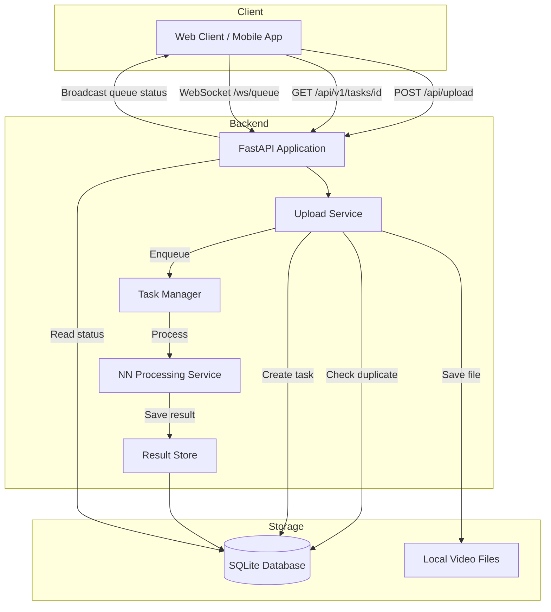

# Python Backend Architecture - Video Processing Service

## Overview

A Python backend service that accepts video file uploads, stores them locally, processes them through a neural network, and returns results to users asynchronously.

## Async Result Retrieval - Design Options

For long-running neural network operations, here are the recommended approaches:

### Recommended Approach: **Polling + WebSocket (Required)**
- **Polling**: Client uploads video → receives a `task_id` → polls `/api/v1/tasks/{task_id}` for status
- **WebSocket**: Real-time bidirectional communication for instant updates
- **Broadcast Channel**: All connected clients receive updates about the processing queue, including:
  - Currently processing file name
  - Queue of pending tasks
  - Recently completed tasks
  - NN busy/idle status

## System Architecture



## Project Structure

```
mouseTrack-backend/
├── app/
│   ├── __init__.py
│   ├── main.py                 # FastAPI application entry point
│   ├── config.py               # Configuration settings
│   ├── database.py             # Database connection and session management
│   ├── models/
│   │   ├── __init__.py
│   │   ├── task.py             # Task model
│   │   └── user.py             # User model (placeholder for auth)
│   ├── schemas/
│   │   ├── __init__.py
│   │   ├── task.py             # Pydantic schemas for tasks
│   │   └── user.py             # Pydantic schemas for users
│   ├── api/
│   │   ├── __init__.py
│   │   ├── upload.py           # Upload endpoint
│   │   ├── tasks.py            # Task status and result endpoints
│   │   └── auth.py             # Auth endpoints (placeholder)
│   ├── services/
│   │   ├── __init__.py
│   │   ├── upload_service.py   # File handling and deduplication
│   │   ├── task_service.py     # Task lifecycle management
│   │   ├── nn_processor.py     # Neural network processing (generic)
│   │   └── websocket_manager.py # WebSocket connection management and broadcast
│   └── utils/
│       ├── __init__.py
│       └── file_utils.py       # File hashing and validation
├── videos/                     # Local video storage
├── migrations/                 # Alembic migrations
├── tests/
│   ├── __init__.py
│   ├── test_upload.py
│   └── test_tasks.py
├── .env                        # Environment variables
├── .env.example
├── requirements.txt
├── alembic.ini
└── README.md
```

## Database Models

### Task Model
| Field | Type | Description |
|-------|------|-------------|
| id | UUID | Primary key |
| user_id | String | User identifier (for future auth) |
| video_hash | String | SHA-256 hash for deduplication |
| video_path | String | Local file path |
| status | Enum | pending, processing, completed, failed |
| result | JSON | Processing result (nullable) |
| error_message | String | Error details if failed |
| created_at | DateTime | Task creation time |
| updated_at | DateTime | Last update time |

### User Model (Placeholder)
| Field | Type | Description |
|-------|------|-------------|
| id | UUID | Primary key |
| external_id | String | External auth provider ID |
| created_at | DateTime | Creation time |

## API Endpoints

### 1. Upload Video
```
POST /api/v1/videos/upload
Content-Type: multipart/form-data

Request:
- video: File (video file)
- user_id: String (temporary, will be replaced by auth token)

Response (200):
{
    "task_id": "uuid",
    "status": "pending",
    "message": "Video uploaded successfully",
    "is_duplicate": false
}

Response (200) - Duplicate:
{
    "task_id": "uuid",
    "status": "completed",
    "message": "Video already processed",
    "is_duplicate": true,
    "result": {...}
}
```

### 2. Get Task Status
```
GET /api/v1/tasks/{task_id}

Response (200):
{
    "task_id": "uuid",
    "status": "processing",
    "progress": 45,
    "created_at": "2024-01-01T00:00:00Z",
    "updated_at": "2024-01-01T00:01:00Z"
}
```

### 3. Get Task Result
```
GET /api/v1/tasks/{task_id}/result

Response (200):
{
    "task_id": "uuid",
    "status": "completed",
    "result": {...},
    "completed_at": "2024-01-01T00:05:00Z"
}

Response (202):
{
    "task_id": "uuid",
    "status": "processing",
    "message": "Result not ready yet"
}
```

### 4. WebSocket for Real-time Queue Status
```
WebSocket /ws/queue

Client connects to receive real-time updates about:
- NN processing status (busy/idle)
- Currently processing file name
- Queue of pending tasks
- Recently completed tasks

Server messages:
{
    "type": "queue_update",
    "nn_status": "busy",
    "current_processing": {
        "task_id": "uuid",
        "filename": "video.mp4",
        "user_id": "user123",
        "progress": 45
    },
    "pending_queue": [
        {"task_id": "uuid", "filename": "video2.mp4", "user_id": "user456"}
    ],
    "recently_completed": [
        {"task_id": "uuid", "filename": "video3.mp4", "completed_at": "..."}
    ]
}

{
    "type": "nn_status_change",
    "status": "idle" | "busy",
    "timestamp": "2024-01-01T00:00:00Z"
}

{
    "type": "task_completed",
    "task_id": "uuid",
    "filename": "video.mp4"
}
```

## Authentication Placeholder Design

The authentication system is designed to be added later without breaking changes:

1. **Current**: `user_id` passed as a form field in upload requests
2. **Future**: JWT token in Authorization header, `user_id` extracted from token
3. **Middleware**: Auth middleware will be added to intercept requests
4. **Database**: User model already exists for future expansion

### Migration Path
```
Current: POST /api/upload {video, user_id}
Future:  POST /api/upload {video} + Authorization: Bearer <token>

The API contract remains the same - only the authentication method changes.
```

## Neural Network Integration Point

The `nn_processor.py` service provides a generic interface:

```python
class NNProcessor(ABC):
    @abstractmethod
    async def process(self, video_path: str) -> dict:
        """Process video and return result dict"""
        pass

class DefaultNNProcessor(NNProcessor):
    async def process(self, video_path: str) -> dict:
        # Placeholder implementation
        # Replace with actual NN integration
        pass
```

This allows easy swapping of the neural network implementation without changing the rest of the system.

## Technology Stack

| Component | Technology | Reason |
|-----------|------------|--------|
| Framework | FastAPI | Async support, automatic docs, type safety |
| Database | SQLite + SQLAlchemy | Simple setup, easy migration to PostgreSQL |
| Task Queue | Background tasks (asyncio) | Simple, no external dependencies |
| WebSocket | FastAPI WebSocket + ConnectionManager | Real-time broadcast to all clients |
| File Storage | Local filesystem | Simple, configurable |
| Validation | Pydantic | Type safety, automatic validation |
| Migrations | Alembic | Database versioning |

## Configuration

Environment variables (`.env`):
```
# Server
HOST=0.0.0.0
PORT=8000
DEBUG=True

# Storage
VIDEO_STORAGE_PATH=./videos
MAX_FILE_SIZE_MB=500
ALLOWED_VIDEO_EXTENSIONS=mp4,avi,mov,mkv,webm

# Database
DATABASE_URL=sqlite:///./app.db

# Processing
NN_PROCESSING_TIMEOUT_SECONDS=3600
```

## Next Steps

1. Review and approve this architecture
2. Switch to Code mode to implement
3. Start with project structure and dependencies
4. Implement core features iteratively
