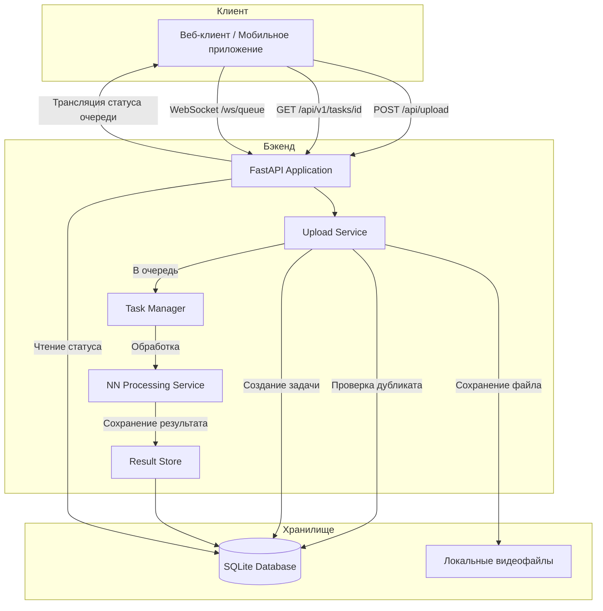

# Архитектура Python Backend — Сервис обработки видео

## Обзор

Python-сервис, который принимает видеофайлы, сохраняет их локально, обрабатывает через нейросеть и асинхронно возвращает результаты пользователям.

## Асинхронное получение результатов — Варианты дизайна

Для длительных операций нейросети рекомендуются следующие подходы:

### Рекомендуемый подход: **Polling + WebSocket (обязательно)**
- **Polling**: Клиент загружает видео → получает `task_id` → опрашивает `/api/v1/tasks/{task_id}` для получения статуса
- **WebSocket**: Двунаправленная связь в реальном времени для мгновенных обновлений
- **Канал трансляции**: Все подключённые клиенты получают обновления о очереди обработки, включая:
  - Имя текущего обрабатываемого файла
  - Очередь ожидающих задач
  - Недавно завершённые задачи
  - Статус нейросети (занят/свободен)

## Системная архитектура



## Структура проекта

```
mouseTrack-backend/
├── app/
│   ├── __init__.py
│   ├── main.py                 # Точка входа FastAPI
│   ├── config.py               # Настройки конфигурации
│   ├── database.py             # Подключение к БД и управление сессиями
│   ├── models/
│   │   ├── __init__.py
│   │   ├── task.py             # Модель задачи
│   │   └── user.py             # Модель пользователя (задел под авторизацию)
│   ├── schemas/
│   │   ├── __init__.py
│   │   ├── task.py             # Pydantic-схемы для задач
│   │   └── user.py             # Pydantic-схемы для пользователей
│   ├── api/
│   │   ├── __init__.py
│   │   ├── upload.py           # Эндпоинт загрузки
│   │   ├── tasks.py            # Эндпоинты статуса и результата
│   │   └── auth.py             # Эндпоинты авторизации (заглушка)
│   ├── services/
│   │   ├── __init__.py
│   │   ├── upload_service.py   # Обработка файлов и дедупликация
│   │   ├── task_service.py     # Управление жизненным циклом задач
│   │   ├── nn_processor.py     # Обработка нейросетью (универсальная)
│   │   └── websocket_manager.py # Управление WebSocket-соединениями и трансляция
│   └── utils/
│       ├── __init__.py
│       └── file_utils.py       # Хеширование и валидация файлов
├── videos/                     # Локальное хранилище видео
├── migrations/                 # Миграции Alembic
├── tests/
│   ├── __init__.py
│   ├── test_upload.py
│   └── test_tasks.py
├── .env                        # Переменные окружения
├── .env.example
├── requirements.txt
├── alembic.ini
└── README.md
```

## Модели базы данных

### Модель задачи (Task)
| Поле | Тип | Описание |
|------|-----|----------|
| id | UUID | Первичный ключ |
| user_id | String | Идентификатор пользователя (для будущей авторизации) |
| video_hash | String | SHA-256 хеш для дедупликации |
| video_path | String | Локальный путь к файлу |
| status | Enum | pending, processing, completed, failed |
| result | JSON | Результат обработки (может быть null) |
| error_message | String | Сообщение об ошибке при сбое |
| created_at | DateTime | Время создания задачи |
| updated_at | DateTime | Время последнего обновления |

### Модель пользователя (User) — заглушка
| Поле | Тип | Описание |
|------|-----|----------|
| id | UUID | Первичный ключ |
| external_id | String | ID от внешнего провайдера авторизации |
| created_at | DateTime | Время создания |

## Эндпоинты API

### 1. Загрузка видео
```
POST /api/v1/videos/upload
Content-Type: multipart/form-data

Запрос:
- video: File (видеофайл)
- user_id: String (временно, будет заменён на auth-токен)

Ответ (200):
{
    "task_id": "uuid",
    "status": "pending",
    "message": "Видео успешно загружено",
    "is_duplicate": false
}

Ответ (200) — дубликат:
{
    "task_id": "uuid",
    "status": "completed",
    "message": "Видео уже обработано",
    "is_duplicate": true,
    "result": {...}
}
```

### 2. Получение статуса задачи
```
GET /api/v1/tasks/{task_id}

Ответ (200):
{
    "task_id": "uuid",
    "status": "processing",
    "progress": 45,
    "created_at": "2024-01-01T00:00:00Z",
    "updated_at": "2024-01-01T00:01:00Z"
}
```

### 3. Получение результата задачи
```
GET /api/v1/tasks/{task_id}/result

Ответ (200):
{
    "task_id": "uuid",
    "status": "completed",
    "result": {...},
    "completed_at": "2024-01-01T00:05:00Z"
}

Ответ (202):
{
    "task_id": "uuid",
    "status": "processing",
    "message": "Результат ещё не готов"
}
```

### 4. WebSocket — статус очереди в реальном времени
```
WebSocket /ws/queue

Клиент подключается для получения обновлений в реальном времени:
- Статус обработки нейросетью (занят/свободен)
- Имя текущего обрабатываемого файла
- Очередь ожидающих задач
- Недавно завершённые задачи

Сообщения сервера:
{
    "type": "queue_update",
    "nn_status": "busy",
    "current_processing": {
        "task_id": "uuid",
        "filename": "video.mp4",
        "user_id": "user123",
        "progress": 45
    },
    "pending_queue": [
        {"task_id": "uuid", "filename": "video2.mp4", "user_id": "user456"}
    ],
    "recently_completed": [
        {"task_id": "uuid", "filename": "video3.mp4", "completed_at": "..."}
    ]
}

{
    "type": "nn_status_change",
    "status": "idle" | "busy",
    "timestamp": "2024-01-01T00:00:00Z"
}

{
    "type": "task_completed",
    "task_id": "uuid",
    "filename": "video.mp4"
}
```

## Дизайн заглушки авторизации

Система авторизации спроектирована для добавления в будущем без ломающих изменений:

1. **Сейчас**: `user_id` передаётся как поле формы в запросах загрузки
2. **В будущем**: JWT-токен в заголовке Authorization, `user_id` извлекается из токена
3. **Middleware**: Middleware авторизации будет добавлен для перехвата запросов
4. **База данных**: Модель пользователя уже существует для будущего расширения

### Путь миграции
```
Сейчас:  POST /api/upload {video, user_id}
В будущем: POST /api/upload {video} + Authorization: Bearer <token>

Контракт API остаётся прежним — меняется только метод аутентификации.
```

## Точка интеграции нейросети

Сервис `nn_processor.py` предоставляет универсальный интерфейс:

```python
class NNProcessor(ABC):
    @abstractmethod
    async def process(self, video_path: str) -> dict:
        """Обработать видео и вернуть словарь с результатом"""
        pass

class DefaultNNProcessor(NNProcessor):
    async def process(self, video_path: str) -> dict:
        # Заглушка — замените на реальную интеграцию
        pass
```

Это позволяет легко заменить реализацию нейросети без изменения остальной системы.

## Технологический стек

| Компонент | Технология | Причина |
|-----------|------------|---------|
| Фреймворк | FastAPI | Асинхронность, автоматическая документация, типизация |
| База данных | SQLite + SQLAlchemy | Простая настройка, лёгкая миграция на PostgreSQL |
| Очередь задач | Background tasks (asyncio) | Простота, без внешних зависимостей |
| WebSocket | FastAPI WebSocket + ConnectionManager | Трансляция в реальном времени всем клиентам |
| Хранение файлов | Локальная файловая система | Простота, настраиваемость |
| Валидация | Pydantic | Типизация, автоматическая валидация |
| Миграции | Alembic | Версионирование БД |

## Конфигурация

Переменные окружения (`.env`):
```
# Сервер
HOST=0.0.0.0
PORT=8000
DEBUG=True

# Хранилище
VIDEO_STORAGE_PATH=./videos
MAX_FILE_SIZE_MB=500
ALLOWED_VIDEO_EXTENSIONS=mp4,avi,mov,mkv,webm

# База данных
DATABASE_URL=sqlite:///./app.db

# Обработка
NN_PROCESSING_TIMEOUT_SECONDS=3600
```

## Следующие шаги

1. Проверить и утвердить архитектуру
2. Переключиться в режим Code для реализации
3. Начать со структуры проекта и зависимостей
4. Реализовать основные функции итеративно
